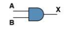
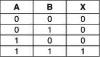
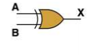
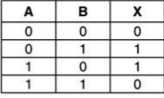
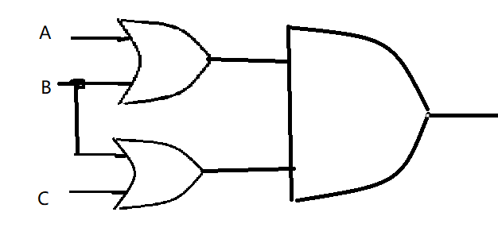
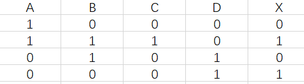
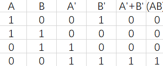

1) Give the three representations of an AND gate and say in your words what AND means.

答：[1]Boolean expressions：X=AB;
    [2]Logic diagram:
    [3]Truth table:

2) Give the three representations of an XOR gate and say in your words what XOR means
答：[1]Boolean expressions:X=A⊕B;。

[2]Logic diagram: 

[3]Truth table: 

 3) Draw a circuit diagram corresponding to the following Boolean expression: (A + B)(B + C)
    答： 

4) Show the behavior of the following circuit with a truth table:

5) What is circuit equivalence? Use truth tableto prove the formula.（AB)’ = A’ + B’

 6) There are eight 1bit full adder integrated circuits. Combine them to 8bit adder circuit using the following box diagram.

7) Logical binary operations can be used to modify bit pattern. Such as
(X8X7X6X5X4X3X2X1
)2 and (00001111)2 = (0000X4X3X2X1
)2
We called that (00001111)2
is a mask which only makes low 4 bits to work.
Fill the follow expression。

(1) (X8X7X6X5X4X3X2X1
)2 or (00001111)2 = (X8X7X6X5X4）1111 )2

(2) (X8X7X6X5X4X3X2X1
)2
xor (00001111)2 = (（X8X7X6X5）not（X4X3X2X1） )2

(3) ((X8X7X6X5X4X3X2X1
)2 and (11110000)2 )
or (not (X8X7X6X5X4X3X2X1
)2
and (00001111)2
) = ((X8X7X6X5)not(X4X3X2X1)2

# 解释

## logic gate：
In electronics, a logic gate is an idealized or physical device implementing a Boolean function; that is, it performs a logical operation on one or more binary inputs and produces a single binary output. Depending on the context, the term may refer to an ideal logic gate, one that has for instance zero rise time and unlimited fan-out, or it may refer to a non-ideal physical device[1] (see Ideal and real op-amps for comparison).
逻辑门是在集成电路上的基本组件。简单的逻辑门可由晶体管组成。这些晶体管的组合可以使代表两种信号的高低电平在通过它们之后产生高电平或者低电平的信号。高、低电平可以分别代表逻辑上的“真”与“假”或二进制当中的1和0，从而实现逻辑运算。常见的逻辑门包括“与”闸，“或”闸，“非”闸，“异或”闸（也称：互斥或）等等。

## )Boolean algebra
In mathematics and mathematical logic, Boolean algebra is the branch of algebra in which the values of the variables are the truth values true and false, usually denoted 1 and 0 respectively. Instead of elementary algebra where the values of the variables are numbers, and the prime operations are addition and multiplication, the main operations of Boolean algebra are the conjunction and denoted as ∧, the disjunction or denoted as ∨, and the negation not denoted as ?. It is thus a formalism for describing logical relations in the same way that elementary algebra describes numeric relations.
在数学和数理逻辑中，逻辑代数（有时也称开关代数、布尔代数）是变量的值仅为真和假两种真值（通常记作 1 和 0）的代数的子领域。初等代数中变量的值是数字，并且主要运算是加法和乘法，而逻辑代数的主要运算有合取与，记为∧；析取或 ，记为∨；否定非 ，记为? 。因此，它是以普通代数描述数字关系相同的方式来描述逻辑关系的形式主义。

## 自学存储电路。维基百科：“Flip-flop”，选择中文：
中文翻译：触发器

SR latch可储存4或8个bit
