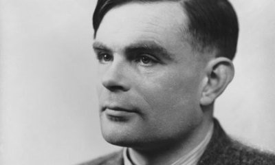

## 艾伦·麦席森·图灵
 
艾伦·麦席森·图灵（Alan Mathison Turing，1912年6月23日－1954年6月7日），英国数学家、逻辑学家，被称为计算机科学之父，人工智能之父。

* 主要成就 

1.“计算机科学之父”

2.提出“图灵测试”概念

3.人工智能 

4.破解德国的著名密码系统Enigma

## 图灵测试
图灵测试由艾伦·麦席森·图灵发明，指测试者与被测试者（一个人和一台机器）隔开的情况下，通过一些装置（如键盘）向被测试者随意提问。
进行多次测试后，如果有超过30%的测试者不能确定出被测试者是人还是机器，那么这台机器就通过了测试，并被认为具有人类智能。

图灵测试为判定机器是否具有人工智能制定了标准。

## 图灵奖
为纪念图灵，由美国计算机协会（ACM）于1966年设立，专门奖励那些对计算机事业作出重要贡献的个人。

它是计算机界最负盛名，.最崇高的一个奖项，有“计算机界的诺贝尔奖”之称
通常一年只仅有一人获奖