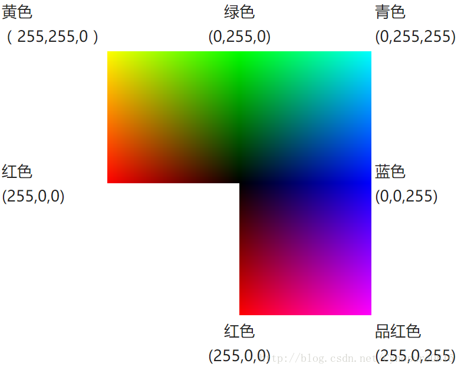

## 色彩表示与编码
RGB色彩模式是工业界的一种颜色标准，是通过对红(R)、绿(G)、蓝(B)三个颜色通道的变化以及它们相互之间的叠加来得到各式各样的颜色的，RGB即是代表红、绿、蓝三个通道的颜色，这个标准几乎包括了人类视力所能感知的所有颜色，是目前运用最广的颜色系统之一。

一共有绿，红， 蓝，三种基色，再用0~255间的数值表示每种颜色不同的深度混合在一起，表示出另一种颜色；例如：

黄色的RGB编码为：#FFFF00;
意味着调染出黄色需要深度255的红色与深度255的绿色，以及深度为零的蓝色，分别用16进制表示：

红(R)：（FF）;
绿(G)：（FF）;蓝(B):(00)

故黄色的RGB编码为：#FFFF00.

以下为部分颜色的RGB编码：

