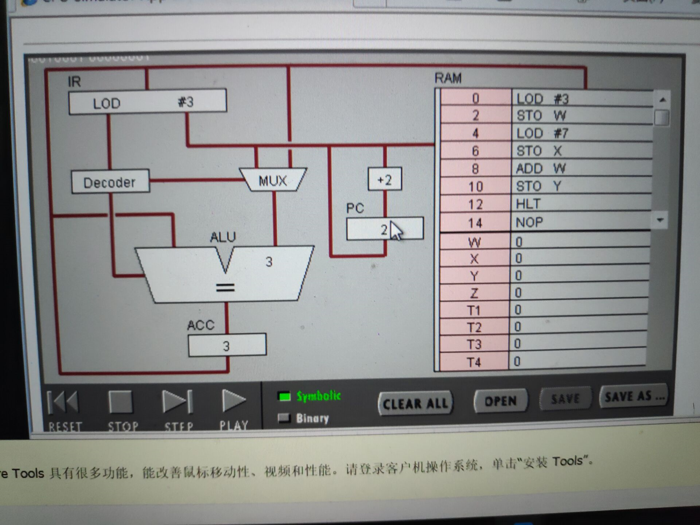
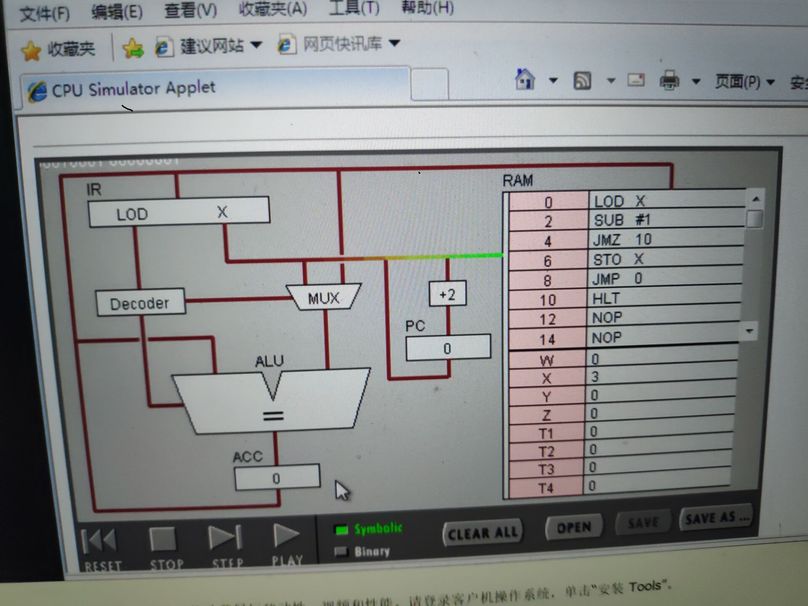
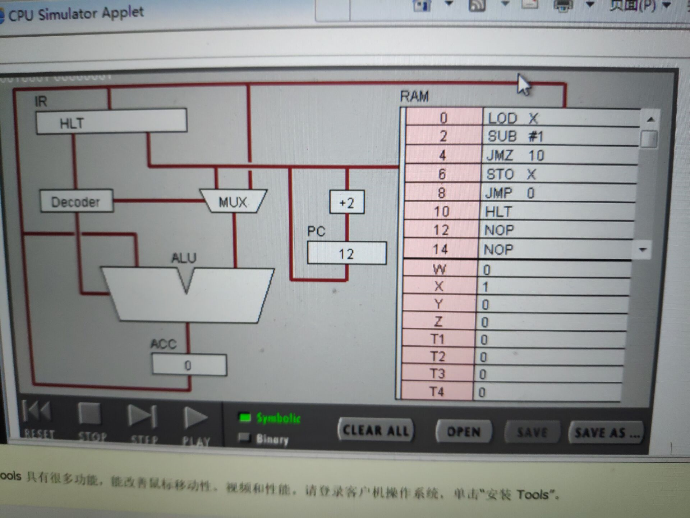

实验名称：汇编语言实验报告

学号：18342114

姓名：杨举

# 目录：

## 1.任务1：简单程序
### （1）打开网页 The PIPPIN User’s Guide ，然后输入 Program 1：Add 2 number

### （2）点step after step。观察并回答下面问题：
### （3）点击“Binary”,观察回答下面问题
## 2.任务2：简单循环

### 1） 输入程序Program 2，运行并回答问题：
### （2） 修改该程序，用机器语言实现 10+9+8+..1 ，输出结果存放于内存 Y

## 实验目标： 
### 1理解冯·诺伊曼计算机的结构
### 2理解机器指令的构成
### 3理解机器指令执行周期
### 4用汇编编写简单程序

## 任务一 ：简单程序
（1）打开网页 The PIPPIN User’s Guide ，然后输入 Program 1：Add 2 number

（2）点step after step。观察并回答下面问题：

#### 1PC，IR 寄存器的作用。

答：IR：指令寄存器，用来保存当前正在执行的一条指令 

PC：程序计数器，存放下一条指令在内存中的地址
#### 2ACC 寄存器的全称与作用。
答：ACC：累加寄存器，功能是当运算器的算术逻辑单元(ALU)执行全部算术和逻辑运算时，为ALU提供一个工作区，暂时存放ALU运算结果
#### 3用“LOD #3”指令的执行过程，解释Fetch-Execute周期。
答：pc=0,fetch 地址为0的指令：LOD #3 ,将指令LOD #3 储存在IR中,decode该条指令；将3寄存,PC+2,PC=2,寻找地址为2 的指令。
#### 4用“ADD W” 指令的执行过程，解释Fetch-Execute周期。
答：PC=8，fetch 地址为8的指令：ADD W,将该指令储存在IR中，decode该条指令，将ACC中储存的7放入寄存器，执行W +7,ACC=10,PC+2=10;寻找地址为10 的指令

#### 5“LOD #3” 与 “ADD W” 指令的执行在Fetch-Execute周期级别，有什么不同。
LOD #3仅是将3储存在ACC中
ADD W需要调取ACC的数据与其相加

（3）点击“Binary”,观察回答下面问题

#### 1写出指令 “LOD #7” 的二进制形式，按指令结构，解释每部分的含义。
答：00010100 00000111
#### 2解释 RAM 的地址。
储存该条指令的地址0开头的是指令；1开头的是数据
#### 3该机器CPU是几位的？（按累加器的位数）
八位
#### 4写出该程序对应的 C语言表达。
#include<stdio.h>
int main(){
    int  w = 3;
    int x = 7;
    int y;
    y = w + x;
}
## 2.任务2：简单循环

（1） 输入程序Program 2，运行并回答问题：

#### 1用一句话总结程序的功能

答：是一条执行三次的循环
#### 2写出对应的 c 语言程序

    #include<stdio.h>

    int main (){
        int x = 3;
        if(x!=0){
            x = x - 1;
        }
        

    }
（2） 修改该程序，用机器语言实现 10+9+8+..1 ，输出结果存放于内存 Y

#### 1写出 c 语言的计算过程
    #include<stdio.h>
    int main（）{
    
    int y=0;
    int i ; 
    for(i=1;i<11;i++){
        y = y + i ;
    }
     return y;
    }
#### 2写出机器语言的计算过程
答：

#### 3用自己的语言，简单总结高级语言与机器语言的区别与联系
答：机器语言是计算机的能直接执行的语言，执行速度最快。但是高级语言的易读写性及易移植性比机器语言强很多
高级语言通过编译器，转换为机器语言。

# 实验小结
the fetch-decode-execute cycle实际上是
Main memory –> fetch instruction –> Decode instruction –>Registers –>Get data –>Execute the instruction –> Main memory
