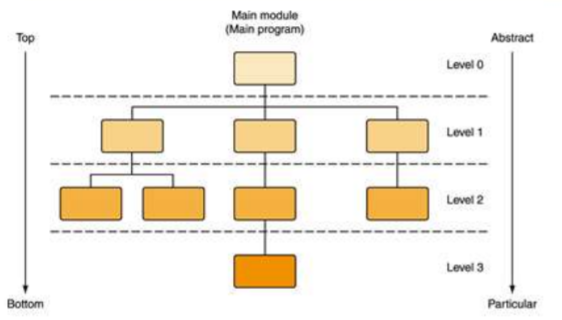

# “自顶向下，逐步求精(Top-down design)”的编程方法

### “自顶向下” 
是将复杂、大的问题划分为小问题，找出问题的关键、重点所在，然后用精确的思维定性、定量地去描述问题。
### “逐步求精” 
是将现实世界的问题经抽象转化为逻辑空间或求解空间的问题。复杂问题经抽象化处理变为相对比较简单的问题。经若干步抽象（精化）处理，最后到求解域中只是比较简单的编程问题。This process continues for as many levels as it takes to
expand every task to the smallest details
• A step that needs to be expanded is an abstract step
## 例：洗衣机工作：
    洗衣机可执行的基本操作如下：
    water_in_switch(open_close) // open 打开上水开关，close关闭 water_out_switch(open_close) // open 打开排水开关，close关闭 get_water_volume() //返回洗衣机内部水的高度motor_run(direction) // 电机转动。left左转，right右转，stop停 time_counter() // 返回当前时间计数，以秒为单位 halt(returncode) //停机，success 成功 failure 失败 

### 正常洗衣的大步骤：
    注水 浸泡 电机转动 排水 停机

### 伪代码描述的控制程序设计如下：
    注水：
    I F  water_in_switch  is  on
    pour  in  water 
    IF  water_volume  is equal to standard_volume
    turn  off  water_in_switch
    stop  pouring  water
    END IF
    END IF  
    浸泡：
    IF  water_in_switch  is  off
    Get time
    IF time is equal to standard time
    stop soaking
    END IF 
    END IF  
    电机转动：
    IF  soaking time is reached 
    start motor running
    WHILE  time is not reached
    Run to left 
    Run to right
    Stop
    END WHILE 
    END IF
    排水：
    IF  motor_run is over
    let out water
    IF  water_volume is equal to 0
    Stop letting out water
    END  IF
    END  IF
    停机：
    IF  water_volume is equal to 0
    Halt
    Turn off the light
    END  IF
