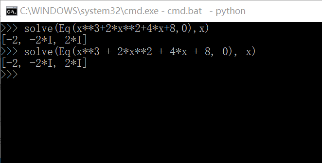
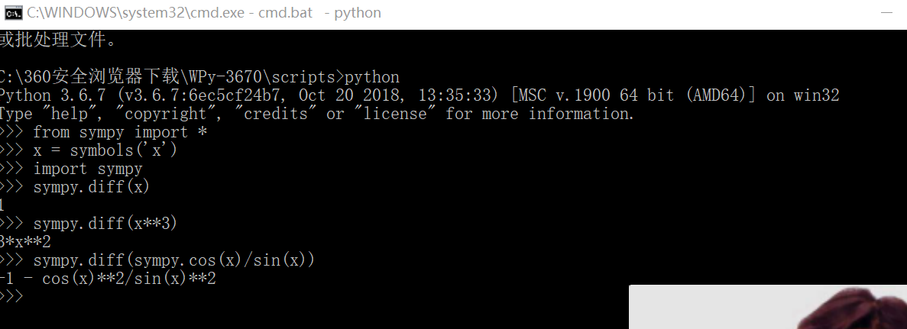
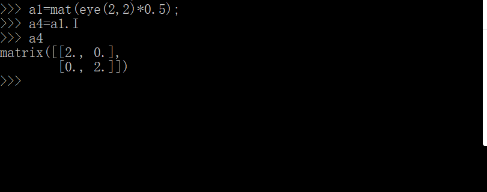
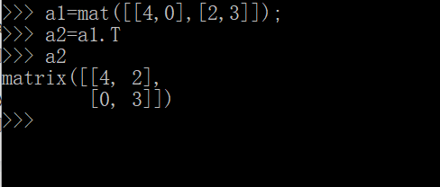

# 使用python求解数学问题的实验报告
学号 18342114；姓名 杨举
## 目录
### 一、实验目标
### 二、实验环境
### 三、实验步骤与结果
#### 一、实验目的
    1 了解一种“解释型”语言 python
    2使用 python 做一些简单的科学计算
#### 二、实验环境
    编程工具：winpython
    操作系统：Windows 
    
#### 三、实验步骤与结果
## 使用python求解

### 1）选择2个高等数学上的作业，如泰勒分解、公式化简、解方程等。 （一般搜索不到有价值的答案）
    1.问：求方程：x^3 + 2x^2 + 4x + 8=0的解
    答：如下图求得解为x1=-2；x2=-2i；x3=2i

    2.问：求函数：cosx/sinx的导函数；
    答:导函数为：-1-cos(x)^2/sin(x)^2

### 2）选择2个线性代数上的作业，如求dot、逆矩阵等，最好会解方程。（建议阅读《用Python做科学计算》）

    1.问矩阵：、
    【0.5   0】
    【0   0.5】的逆。
    答：其逆为：
    【2  0】
    【0  2】如下图；
 

    2.问矩阵、：
    【4   0】
    【2   3】的转置
    答：其转置为：
    【4  2】
    【0  3】如下图
