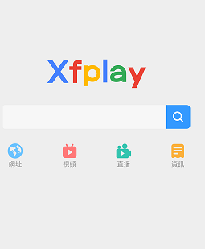
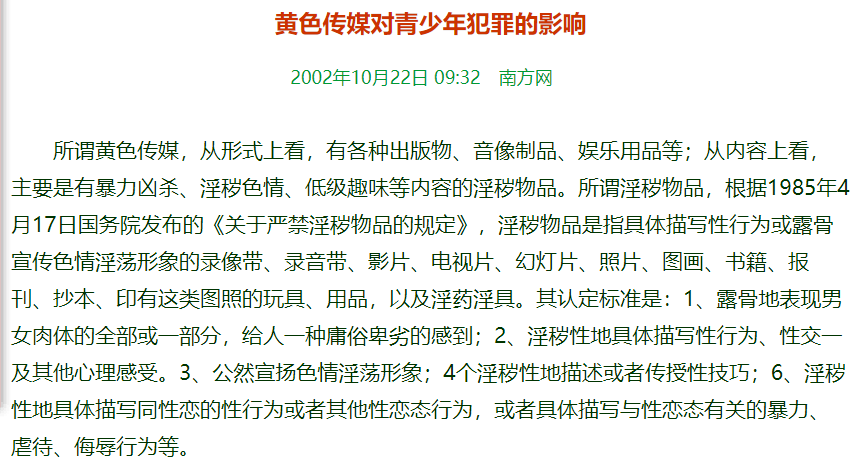

## 影音先锋app的一些伦理风险行为收集：

影音先锋：是基于P2P云3D技术的一款可以在线播放视频和音频的软件。

但不难发现，在百度上搜索影音先锋（XFPLAY）时，出了官网以外，更多的是一些不堪入目的网站：

是空穴来风？还是子虚乌有？

为了寻求真相，我用手机下载了一个影音先锋app：

安装打开后与普通软件并无区别，
但在朋友的介绍下，我得知了一个途径：
在app内打开某网站》果然搜索到了一些色情的东西：尺度之大令人震惊！！！！！

同时从网上可知：的确影音先锋可观看色群情视频（来自http://beijing.qianlong.com/2016/0815/835329.shtml）
## 总结：
    通过搜索与实践，我们发现影音先锋的确可以搜索到色情视频。且没有任何年龄限制，只要你会用手机，会用网络。
    未成年人心智尚未发育健全，容易受外界事物的影响，过早让青少年接触这些精神鸦片会毒害其心智
    

来源：（http://law.southcn.com/fzzt/fzztgk/200210220208.htm）
