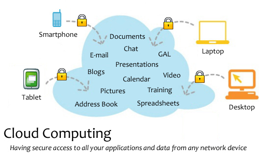

# 互联网时代的盈利模式
## 盈利模式1：在线广告

最主要最常见的网络在线盈利模式，如百度，新浪等，而且大多数个人网站的盈利模式也是这样，靠挂别人的广告生存。
新兴的视频播放网站，在视频播放前的等待时间播放广告(优酷，土豆等)

## 盈利模式2：产品交易性网站

电子商务网站，B2C、B2B。网上销售如（阿里巴巴，当当网）。
## 盈利模式3：网络游戏运营
网络游戏虚拟装备和道具买卖，如网易，steam。

## 云计算：
云计算 [1]  （Cloud Computing）是基于互联网的相关服务的增加、使用和交互模式，通常涉及通过互联网来提供动态易扩展且经常是虚拟化的资源。云是网络、互联网的一种比喻说法。过去在图中往往用云来表示电信网，后来也用来表示互联网和底层基础设施的抽象。因此，云计算甚至可以让你体验每秒10万亿次的运算能力，拥有这么强大的计算能力可以模拟核爆炸、预测气候变化和市场发展趋势。用户通过电脑、笔记本、手机等方式接入数据中心，按自己的需求进行运算。 [2] 
对云计算的定义有多种说法。对于到底什么是云计算，至少可以找到100种解释。 [3]  现阶段广为接受的是美国国家标准与技术研究院（NIST）定义：云计算是一种按使用量付费的模式，这种模式提供可用的、便捷的、按需的网络访问， 进入可配置的计算资源共享池（资源包括网络，服务器，存储，应用软件，服务），这些资源能够被快速提供，只需投入很少的管理工作，或与服务供应商进行很少的交互。 [4] 
（来自百度百科）

（图片来自wiki百科）
### 云计算的部署模型有：
1.公用云:公用云服务可透过网络及第三方服务供应者，开放给客户使用,费用免费或相当廉价。

2.私有云：既有公用云弹性、适合提供服务的特点，又数据与程序皆在组织内管理，且不会受到网络带宽、安全疑虑、法规限制影响，让供应者及用户更能掌控云基础架构、改善安全与弹性

3.社群云与混合云。
### 云计算盈利模式：
1、计算能力服务租赁
2、存储空间服务租赁
3、应用服务租赁
4、综合解决方案租赁1、计算能力服务租赁
2、存储空间服务租赁
3、应用服务租赁
4、综合解决方案租赁